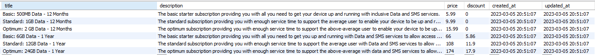

# web-scraper
Web scraper console application for crawling https://wltest.dns-systems.net/ website's subscription packages.
Get data JSON formatted ordered descendant by annual price with the following info: title, description, price and discount (if applicable).

### Prerequisites
`symfony/panther` - library used for getting the HTML elements and query the DOM. In other cases used for functional tests.

### Run application
1. Clone repository `git clone git@github.com:andreicotaga/web-scraper.git`
2. In the root directory `web-scraper` run `docker-compose up -d`
3. Enter the container `docker exec -it php sh`
4. `composer install`
5. Make sure chromedriver is under `/usr/local/bin` folder

### Run unit tests
1. Enter the container `docker exec -it php sh`
2. Execute `php bin/phpunit --testdox --coverage-text`

### Application composite
#### Commands
1. `bin/console app:web:scrape` - it scrapes the given website and adds data to DB

2. `bin/console app:web:fetch`  - it fetches the data in a JSON format and outputs it in console
```angular2html
'[{"title":"Optimum: 24GB Data - 1 Year","description":"The optimum subscription providing you with enough service time to support the above-average with data and SMS services to allow access to your device.","price":174,"discount":
17.9},{"title":"Standard: 12GB Data - 1 Year","description":"The standard subscription providing you with enough service time to support the average user with Data and SMS services to allow access to your device.","price":108,"disco
unt":11.9},{"title":"Basic: 6GB Data - 1 Year","description":"The basic starter subscription providing you with all you need to get you up and running with Data and SMS services to allow access to your device.","price":66,"discount"
:5.86},{"title":"Optimum: 2 GB Data - 12 Months","description":"The optimum subscription providing you with enough service time to support the above-average user to enable your device to be up and running with inclusive Data and SMS
 services","price":15.99,"discount":0},{"title":"Standard: 1GB Data - 12 Months","description":"The standard subscription providing you with enough service time to support the average user to enable your device to be up and running 
with inclusive Data and SMS services.","price":9.99,"discount":0},{"title":"Basic: 500MB Data - 12 Months","description":"The basic starter subscription providing you with all you need to get your device up and running with inclusive Data and SMS services.","price":5.99,"discount":0}]'
```
